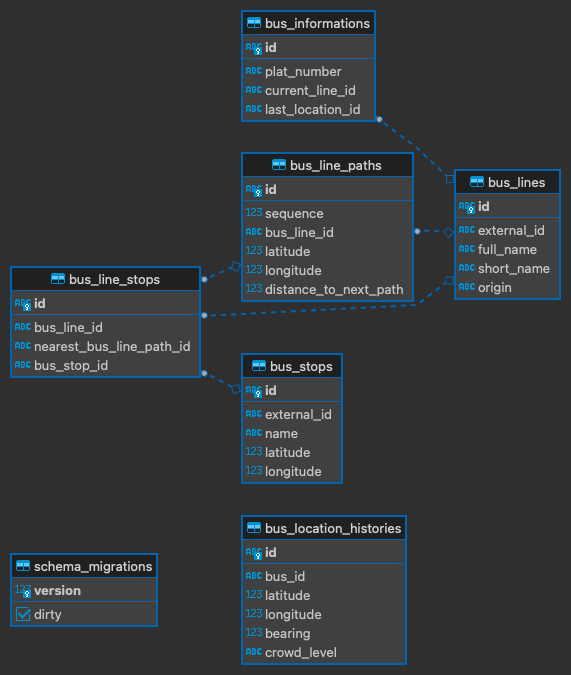
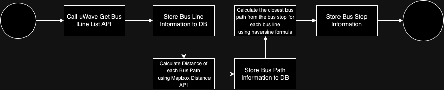
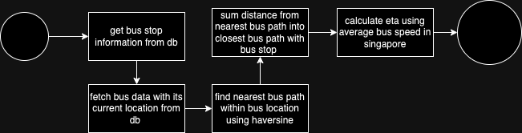

# Design Overview

API Documentation : https://documenter.getpostman.com/view/14768408/2s9YCBsotY

## Database Design

## Populate Data From 3rd Party Flow

### PopulateBusLineInformation

The <b>PopulateBusLineInformation</b> function serves the purpose of transferring data sfrom the https://test.uwave.sg/busLine API into the database. This function is specifically designed to execute just once during the installation process.

### UpdateBusLocation

The <b>UpdateBusLocation</b> function is responsible for retrieving the current location of all bus lines and then storing this information in the database. It is advisable to schedule and run this function periodically within a cron job, ideally every few seconds, to ensure that the bus locations are as close to real-time as possible.

## Calculating Distance and Bus ETA Flow

The bus distance calculation involves determining the nearest bus route from the current bus location using the Haversine formula. Afterward, the total distance is computed by summing up the distances along the bus route from the bus's location to each bus stop's location.

For calculating the ETA, average bus speed data that provided by ChatGPT is used.

In cases where the bus has already moved past the bus stop, both the estimated time of arrival (ETA) and the distance will be unavailable, as the current logic does not account for this scenario.

## Pros, Cons, Limitation

### Pros

- Distance between path is accurate since we use MapBox distance api that calculate the actual path that the bus passes.

### Cons
- The Haversine formula is used to determine the nearest path for the bus, but it may lead to discrepancies when the closest path has already been traversed by the bus.

### Limitation

- Calculating distance for bus that passed bus stop
- Realtime road condition like traffic jam is not measured
- The current logic does not compute the distance between the path and the bus stop because it assumes that the path and the bus stop are located in the same place.

